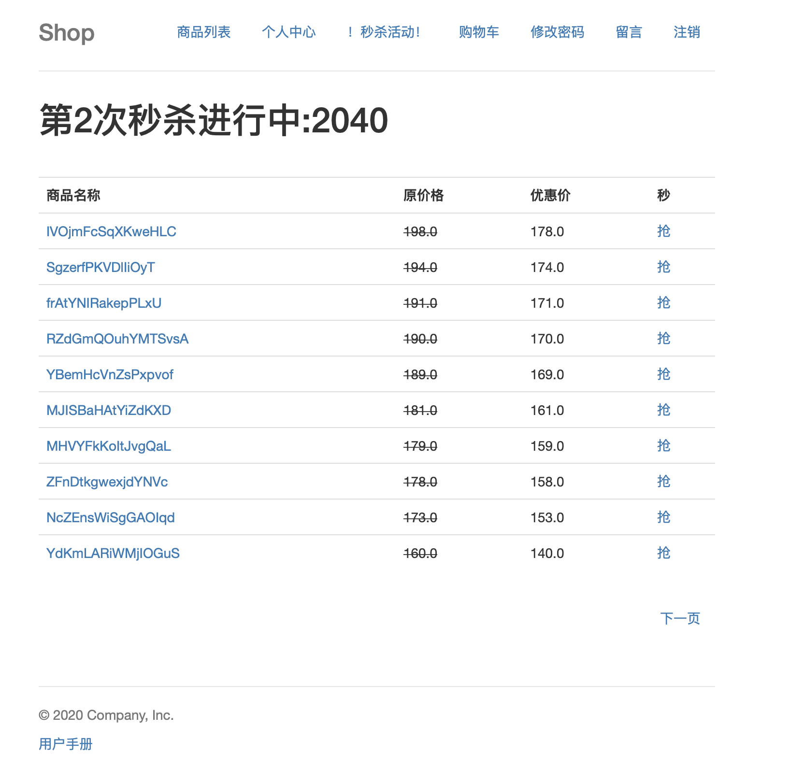

### 一个基于 Python Tornado框架创建的Web应用，预设了一些常见的Web安全漏洞，可用于Web攻击实践

应用中使用了一个SQLite本地数据库，会在程序第一次启动的时候，在应用目录下创建一个sshop.db3文件,用来存放应用数据。

### 通过Docker搭建

你可以通过Docker使用目录下的DockerFile方便的搭建上述系统,并运行。

### 手动搭建

或者你可以手动搭建环境，基于Python2.7,下载相关依赖，手动启动该应用，涉及到的依赖参考requirement.pip。

邮箱：guoyusu@outlook.com

博客：x-mallory.github.io(通过blog上的[DaoVoice ](http://blog.daovoice.io/daovocie_manhua/?utm_source=cauc&utm_campaign=39_campaign&utm_medium=daovoice_widget&utm_term=footer_link&utm_content=one_min)也可进行交流)

